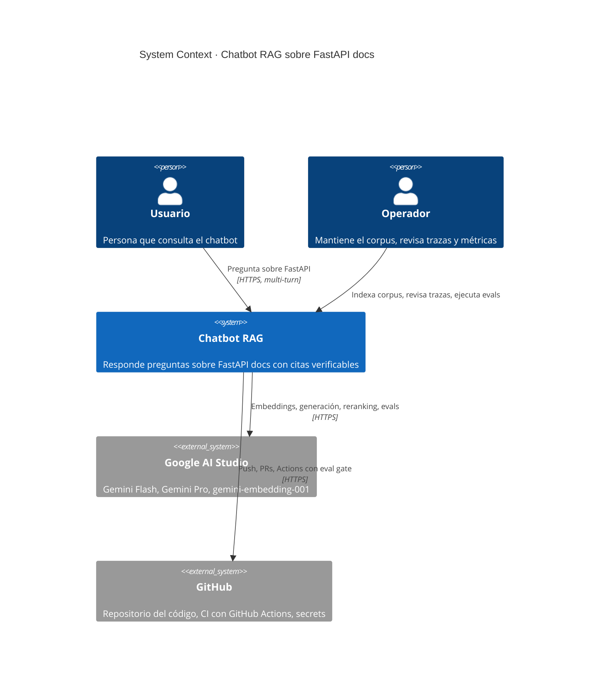

# C4 Level 1 · System Context

> Vista de máximo nivel: el chatbot RAG y los sistemas con los que interactúa.

## Diagrama

## Actores

- **Usuario:** consume el chatbot vía interfaz web. Hace login y mantiene conversaciones multi-turno sobre las docs de FastAPI.
- **Operador:** mantiene el sistema. Indexa el corpus, revisa el dashboard de Phoenix, ejecuta el dataset gold cuando hay cambios y revisa los logs de incidentes de seguridad.

## Sistemas externos

- **Google AI Studio:** único proveedor LLM. Una sola API key cubre embeddings (`gemini-embedding-001`), generación (Gemini Flash), juez de evals (Gemini Pro), reranking y guardrail.
- **GitHub:** alojamiento del código y CI/CD con eval gate.

## Decisiones clave a nivel de sistema

- **Cero terceros LLM más allá de Google.** No hay Anthropic, OpenAI ni Cohere en el camino crítico. Decisión por restricción de cero tarjeta.
- **Sin proveedor de auth externo.** Auth local con FastAPI Users + bcrypt + JWT.
- **Sin observabilidad externa.** Phoenix self-host, no LangSmith ni Datadog.
