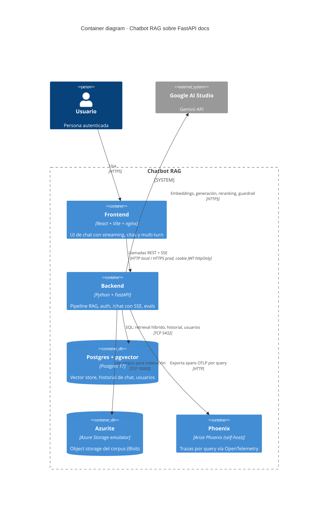

# C4 Level 2 · Containers

> Vista de los contenedores que componen el sistema y cómo se comunican.

## Diagrama

## Contenedores

### Frontend
- React + Vite en dev (HMR), build estático servido por nginx en prod local.
- Hook de streaming SSE para consumir `/chat`.
- Estado mínimo en `useState` y `useReducer`. Sin Redux ni state managers pesados.
- Pantallas: login, register, chat.

### Backend
- Python 3.12, FastAPI, LangChain v1, langchain-google-genai.
- Módulos: `auth`, `chat`, `indexing`, `retrieval`, `evals`, `security`.
- Endpoint `/chat` con SSE. Endpoints `/auth/*` para registro y login.
- Instrumentación OpenTelemetry (export a Phoenix) en cada llamada al modelo.

### Postgres + pgvector
- Postgres 17 con pgvector 0.8+.
- Tablas: `users`, `chat_sessions`, `chat_messages`, `chunks` (vector store), `eval_runs`.
- Índices: HNSW sobre `chunks.embedding`, GIN sobre `chunks.content_tsv`.

### Azurite
- Emulador de Azure Blob, Queue y Table.
- Solo usamos Blob: container `corpus` con los Markdown de FastAPI docs.
- Connection string del emulador en `.env`.

### Phoenix
- Arize Phoenix self-host en un único contenedor (`arizephoenix/phoenix`).
- Recibe spans OTLP del backend (OpenInference para LangChain).
- UI y colector en `localhost:6006`. Persistencia en volumen propio.

## Puertos expuestos en local

| Servicio | Puerto |
|---|---|
| Frontend (Vite dev) | 5173 |
| Frontend (nginx prod local) | 80 |
| Backend FastAPI | 8000 |
| Postgres principal | 5432 |
| Azurite (Blob) | 10000 |
| Azurite (Queue) | 10001 |
| Azurite (Table) | 10002 |
| Phoenix (UI + OTLP) | 6006 |
