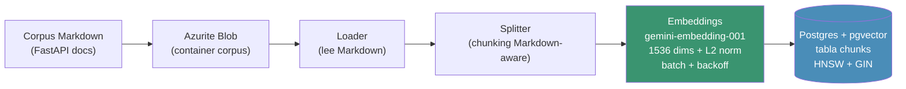
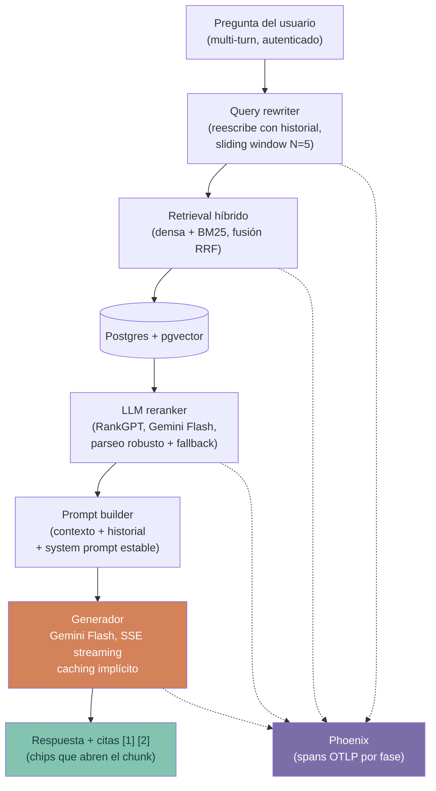

# Flujo del pipeline RAG

> El recorrido de los datos por el sistema, en dos fases: indexación (offline) y query (online). El C4 de contenedores (`02-containers.md`) muestra las cajas; esto muestra el flujo que las atraviesa.

## Fase de indexación (offline)

Se ejecuta cuando cambia el corpus. Deja el vector store listo para consultar.

## Fase de query (online)

Cada pregunta del usuario recorre estas etapas. Cada una emite un span a Phoenix.

## Lectura del diagrama

**Indexación:**
- Patrón emulator-first: el corpus vive en **Azurite** (emulador de Azure Blob), igual que viviría en Azure en producción.
- **Chunking Markdown-aware**: respeta encabezados y bloques de código en vez de cortar a ciegas por longitud.
- **Embeddings** con `gemini-embedding-001` a 1536 dims (`output_dimensionality` + re-normalización L2), en batch con backoff por rate limit.
- Se persisten en `chunks` con índice **HNSW** (búsqueda vectorial) y **GIN** (full-text para BM25).

**Query:**
- **Query rewriter**: reescribe la pregunta con el historial reciente para que el retrieval funcione en conversaciones multi-turno (una pregunta como "¿y eso cómo se configura?" no tiene sentido sin contexto).
- **Retrieval híbrido**: combina similitud densa y BM25 con **Reciprocal Rank Fusion**.
- **LLM reranker** (RankGPT): reordena los candidatos con Gemini Flash; parseo robusto y fallback si el modelo no devuelve el formato esperado.
- **Generador**: Gemini Flash en streaming SSE. El prefijo del prompt (system + contexto) se mantiene estable para que el **caching implícito** de Gemini abarate los turnos siguientes.
- **Citas**: la respuesta incluye marcadores `[1]`, `[2]` que el frontend resuelve a chips que abren el chunk citado.

**Observabilidad transversal:** cada fase emite un span OTLP a **Phoenix**, lo que permite ver latencia por etapa, consumo por usuario e impacto del caching (ver `02-containers.md`).

## Mapa fase → bloque de construcción

| Fase del pipeline | Bloque que la construye |
|---|---|
| Corpus + indexación (loader, splitter, embeddings, schema) | B |
| Retrieval híbrido + reranker + rewriter | R |
| Prompt builder + generador SSE + citas | CH |
| Observabilidad (spans por fase) | R (inicial) + F (consolidada) |
