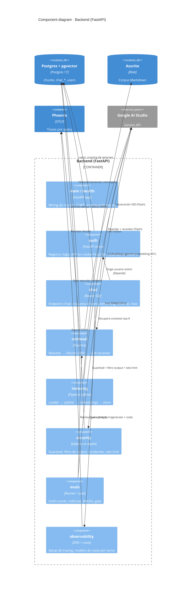

# C4 Level 3 · Componentes del backend

> Detalle interno del contenedor **Backend** (`02-containers.md`). Muestra los
> componentes que lo forman, su responsabilidad y cómo colaboran. El flujo de
> datos que los atraviesa está en `03-pipeline.md`; aquí mostramos las cajas y
> sus dependencias. Arquitectura: package-by-feature + puertos finos para
> dependencias externas (ADR-011).

## Diagrama

## Componentes

Cada feature es un paquete en `backend/app/<feature>/` que agrupa su router,
su lógica y sus modelos. Las dependencias externas (Gemini, pgvector, Azurite)
se aíslan tras puertos (`ports.py`: `Protocol`/ABC) con adaptadores, para
mockear en tests y poder cambiar de proveedor sin tocar la lógica (ADR-011).

### `auth` — Autenticación y scoping (ADR-006)
- `router.py`: FastAPI Users con dos backends de cookie (`access_token` 1 h,
  `refresh_token` 7 d), httpOnly + SameSite=Lax; rutas `/auth/*`.
- `manager.py`, `models.py`, `schema.py`, `db.py`: `UserManager`, modelo
  `User` (UUID), schemas Pydantic, async engine propio (psycopg v3).
- Expone `current_active_user`, del que dependen los endpoints de `chat`.

### `chat` — Endpoint de conversación (specs 05/06/07)
- `router.py`: `POST /chat/` con SSE; orquesta el turno completo (carga
  historial → retrieval → build prompt → stream → persiste). `GET
  /chat/sessions[/{id}]` con scoping por usuario.
- `generator.py`: `stream_chat` (Gemini Flash), captura de usage y `finish_reason`.
- `prompts.py`: `build_prompt` (SystemMessage estable + HumanMessage dinámico),
  contexto envuelto en `<context>` como dato no confiable; citas.
- `store.py`: CRUD de sesiones/mensajes, sliding window N=5, `save_turn`
  transaccional con advisory lock.
- `models.py`: dataclasses de dominio (`ChatTurn`, `Citation`, `UsageMeta`…).

### `retrieval` — Recuperación híbrida (specs 02/03/04, ADR-004/005)
- `orchestrator.py`: `retrieve()` = rewrite → embed → hybrid → rerank.
- `hybrid.py`: densa (coseno) + léxica (BM25 `ts_rank_cd`) fusionadas con RRF
  en una única query SQL.
- `reranker.py`: LLM-as-reranker RankGPT listwise (Flash) con parseo tolerante
  y fallback al orden híbrido.
- `rewriter.py`: reescritura multi-turn con sliding window N=5.
- `llm.py`: adaptadores Gemini (chat y embeddings de query).

### `indexing` — Pipeline offline (spec 01, ADR-002/003)
- `pipeline.py`: `run_indexing()` blob → split → embed → store, idempotente.
- `loader.py` (Azurite), `splitter.py` (Markdown-aware, 512/80), `embeddings.py`
  (`gemini-embedding-001` 1536 dims + L2), `store.py` (upsert por `chunk_hash`).

### `security` — Defensa en profundidad (spec 09, OWASP LLM01/LLM02)
- `safety.py` (capa 1): safety settings de Gemini + detección por `finish_reason`.
- `guardrail.py` (capa 2): clasificador Flash legitimate/suspicious/hostile, fail-open.
- (capa 3: system prompt robusto, vive en `prompts/` + `chat/prompts.py`).
- `output_filter.py` (capa 4): redaction PII en streaming + detección de leak.
- `incidents.py` + `rate_limit.py` (capa 5): span `security_incident` con
  `blocking_layer` + rate limit por usuario (30/min).

### `evals` — Evaluación y gate (spec 10, ADR-007/012)
- `runner.py`, `loader.py`, `metrics.py`: gold runner, recall@5/MRR, abstención.
- `judge.py`: RAGAS con Gemini Pro como juez.
- `report.py`, `cli.py`, `telemetry.py`: gate determinista vs juez, CLI, span de calidad.

### `observability` — Trazas y coste (ADR-008)
- `tracing.py`: setup OpenTelemetry → Phoenix (OpenInference para LangChain);
  no-op defensivo si Phoenix no está.
- `cost.py`: `compute_cost(usage, model)` con pricing Gemini anclado por fecha.

### `main` / `health`
- Wiring de los routers (`auth`, `retrieval`, `chat`), CORS y arranque del
  tracing. `GET /health` para liveness (healthchecks de Docker).

## Mapa componente → bloque de construcción

| Componente | Bloque |
|---|---|
| `indexing` | B |
| `retrieval` + `observability` (tracing inicial) | R |
| `chat` | CH |
| `auth` | AU |
| `evals` | E / G (dataset gold) |
| `observability` (coste, dashboards) | F |
| `security` | S |
